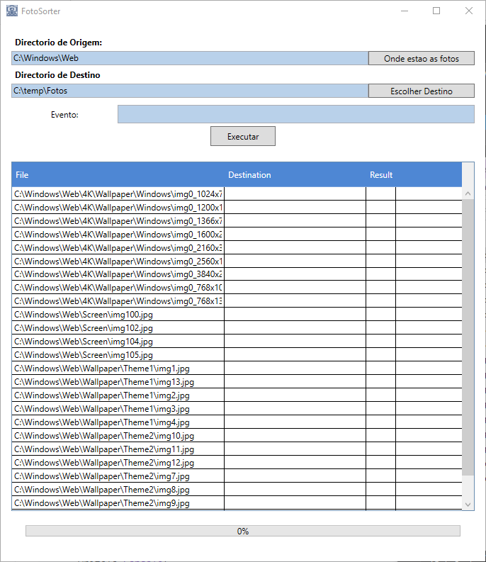

# FotoSorter

## Description

Small app to sort photographs

I wrote this app to help my mom to get her photographs in order, so it is very simple, with very few nobs.

It takes the files `*.jpg,*.jpe,*.jpeg,*.wmf,*.avi,*.mov` and copies them to a `year/month` structure.

## Screenshot

## License

Released under MIT License
